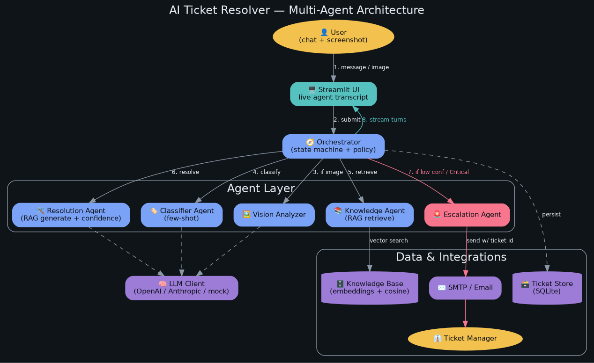

# AI Ticket Resolver — Multi-Agent Support System

A user submits a support ticket (text and/or screenshot). A chain of specialized
AI agents classifies it, searches past resolutions, drafts a fix with a
self-assessed confidence score, and either **auto-resolves** or **escalates**
to the right manager by email — all streamed live in a Streamlit UI.

---

## Architecture



> Regenerate with `python diagrams/generate_architecture.py`

**Request lifecycle:**
```
User  →  Streamlit UI  →  Orchestrator
                               │
           ┌───────────────────┼────────────────────┐
           ▼                   ▼                    ▼
     Vision Analyzer   Classifier Agent      Knowledge Agent
     (screenshot OCR)  (few-shot · RAG)      (cosine search)
                               │
                       Resolution Agent
                       (confidence score)
                               │
             confident? ───YES──▶  Auto-Resolve + reply
                        ───NO───▶  Escalation Agent → email manager
```

---

## Tech Stack

| Layer | Tool | Role |
|---|---|---|
| **UI** | Streamlit | Live-streaming agent conversation |
| **Orchestrator** | Python state machine | Routes tickets through the agent chain |
| **Classification** | LLM · few-shot prompting | Category + priority tagging |
| **Retrieval** | NumPy cosine similarity | Semantic KB search (RAG retrieve) |
| **Generation** | LLM · RAG | Step-by-step resolution + confidence |
| **Vision** | Multimodal LLM | Screenshot → extracted error context |
| **LLM Providers** | OpenAI · Anthropic · Mock | Pluggable; mock works offline |
| **Database** | SQLite | Ticket history + knowledge base |
| **Email** | smtplib · SMTP | Escalation notifications |
| **Config** | python-dotenv | `.env` → typed settings |
| **Diagrams** | Graphviz | Architecture diagram as code |

---

## Prerequisites

```
Python  ·  pip  ·  packages in requirements.txt
```

That's it — the **mock provider** runs the full pipeline with no API key.

To use a real LLM, set in `.env`:

```env
LLM_PROVIDER=openai          # or: anthropic
LLM_API_KEY=sk-...
LLM_MODEL=gpt-4o-mini
```

To send real escalation emails, set in `.env`:

```env
EMAIL_DRY_RUN=false
SMTP_HOST=smtp.gmail.com
SMTP_PORT=587
SMTP_USER=you@gmail.com
SMTP_PASS=your-app-password
```

---

## Quick Start

```bash
git clone https://github.com/P-Sourav/TriageAI.git
cd TriageAI

python -m venv .venv
.venv\Scripts\activate          # Windows
# source .venv/bin/activate     # macOS / Linux

pip install -r requirements.txt
cp .env.example .env

streamlit run app/streamlit_app.py
```

Open `http://localhost:8501` — works immediately with the mock provider.

---

## Project Structure

```
TriageAI/
├── app/
│   └── streamlit_app.py          # UI entry point
├── config/
│   └── settings.py               # All config, read from .env
├── data/                         # SQLite DB (runtime, git-ignored)
├── diagrams/
│   ├── architecture.png
│   ├── prerequisites.png
│   └── generate_architecture.py  # Diagram as code
├── scripts/
│   └── seed_kb.py                # Seed the knowledge base
├── src/
│   ├── agents/                   # Classifier · Knowledge · Resolution · Escalation
│   ├── knowledge_base/           # Vector KB + ticket store
│   ├── llm/                      # LLM adapter (OpenAI / Anthropic / mock)
│   ├── models/                   # Ticket dataclass
│   ├── notifications/            # SMTP emailer
│   ├── orchestrator/             # State machine
│   └── vision/                   # Screenshot analyzer
└── tests/                        # pytest suite (uses mock provider)
```

---

## Makefile

| Command | What it does |
|---|---|
| `make install` | Creates `.venv` and installs all packages from `requirements.txt` |
| `make run` | Launches the Streamlit app at `http://localhost:8501` |
| `make seed` | Populates the knowledge base with 5 sample support articles |
| `make test` | Runs the full pytest suite (no API key needed) |
| `make diagram` | Regenerates `architecture.png` and `prerequisites.png` via Graphviz |
| `make clean` | Deletes `__pycache__`, `.pyc` files, and the SQLite database |

---

## Environment Variables

| Variable | Default | Description |
|---|---|---|
| `LLM_PROVIDER` | `mock` | `mock` / `openai` / `anthropic` |
| `LLM_MODEL` | `gpt-4o-mini` | Chat model ID |
| `LLM_API_KEY` | — | API key for chosen provider |
| `VISION_MODEL` | `gpt-4o-mini` | Model used for screenshot analysis |
| `EMBEDDING_MODEL` | `text-embedding-3-small` | Embeddings model |
| `ESCALATION_THRESHOLD` | `0.55` | Confidence cutoff — below this → escalate |
| `MAX_KB_RESULTS` | `3` | Top-k docs retrieved per query |
| `DB_PATH` | `data/tickets.db` | SQLite file path |
| `EMAIL_DRY_RUN` | `true` | Set `false` to send real emails |
| `SMTP_HOST` | `localhost` | SMTP hostname |
| `SMTP_PORT` | `1025` | SMTP port |
| `SMTP_USER` | — | SMTP login |
| `SMTP_PASS` | — | SMTP password |
| `EMAIL_FROM` | `bot@example.com` | Sender address |
| `MGR_BILLING` | `billing-mgr@example.com` | Escalation target — Billing |
| `MGR_TECHNICAL` | `tech-lead@example.com` | Escalation target — Technical |
| `MGR_ACCOUNT` | `accounts@example.com` | Escalation target — Account |
| `MGR_NETWORK` | `network-ops@example.com` | Escalation target — Network |
| `MGR_OTHER` | `support-mgr@example.com` | Escalation target — Other |

---

## Escalation Logic

A ticket escalates when **any** of these hold:

| Condition | Trigger |
|---|---|
| Priority = `Critical` | Always escalate, no confidence check |
| `needs_human = true` | Resolution Agent flagged it as beyond its ability |
| Confidence `< 0.55` | Agent not confident enough to auto-resolve |

Every ticket gets a `TCK-YYYYMMDD-XXXXXX` ID, stored in SQLite, and is
queryable from the sidebar for audit and lookup.

---

## Running Tests

```bash
pytest tests/ -v
```

All tests use the mock provider — no API key or network required.
